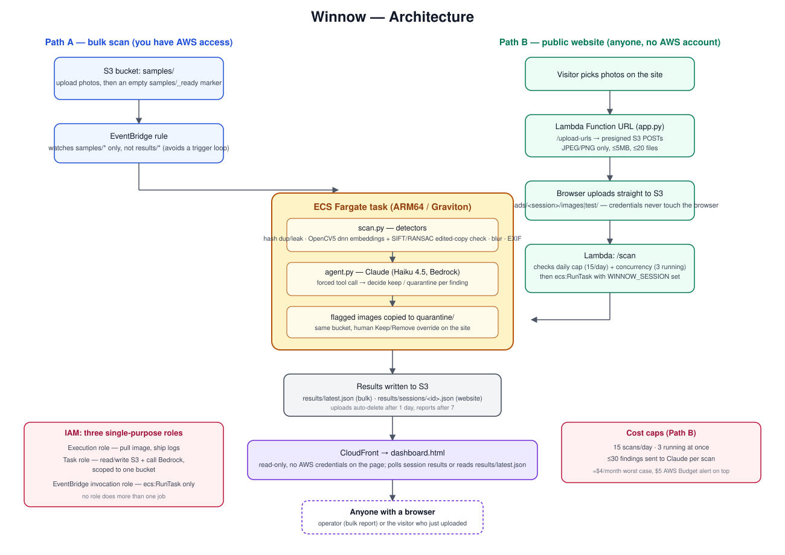

# Winnow

A data-quality auditor for computer vision training datasets. Built for the [OpenCV AI Competition 2026](https://opencv26.devpost.com/) (OpenCV 5 + AWS).

Point it at a folder of training images and it flags the things that quietly corrupt a model before anyone notices: near-duplicate photos, images duplicated across train/test splits (leakage), a test set that looks nothing like the training set, photos taken seconds apart on both sides of a split, blurry images, a watermark or frame shared across the set, photos whose files say they are AI-generated or from a stock agency, label mistakes, and EXIF orientation tags that don't match how an image actually displays (which shifts bounding boxes without warning). It never stores or forwards the images themselves, everything runs read-in-place.

**Try it:** https://d1oc3ay9n04ubj.cloudfront.net/ — upload up to 20 photos and get a report in about a minute, no install or account needed.

## What it catches

| Problem | How | Why it matters |
|---|---|---|
| Train/test leaks | Both duplicate checks below, run between the training and test sets | A test photo the model has already seen inflates its score without it generalizing any better |
| Exact and compressed copies | Perceptual hash (`cv2.img_hash.BlockMeanHash`), distance ≤ 5, confirmed by ≥ 8 shared SIFT keypoints or ≥ 0.85 embedding similarity | Duplicates overweight some examples and hide leaks. The confirmation exists because raw hashes collide on low-texture photos (see the full audit below) |
| Edited copies (crops, mirrors, recolors) | Two stages: MobileNetV2 embeddings through OpenCV 5's `cv2.dnn` nominate look-alikes (cosine ≥ 0.80), then SIFT keypoints + RANSAC confirm ≥ 25 points agree on one geometric transform | The perceptual hash catches 0% of cropped or mirrored copies (see Evaluation). Embeddings alone flag different photos of the same kind of thing; the geometric check is what tells "same photo" from "same subject" |
| Blurry images | Laplacian variance ≤ 200 | Out-of-focus images add noise instead of signal |
| Risky EXIF orientation | Orientation tag ≠ 1 (normal) | Labels drawn on the unrotated photo may no longer line up. Winnow flags the risk, and with label files it confirms it (see label problems below) |
| Train/test shift | The two sets' mean MobileNetV2 embeddings, compared by squared distance. The p-value comes from shuffling which photos count as test 2,000 times; flagged at p ≤ 0.05, needs ≥ 5 photos in each set | A test set drawn from a different kind of picture gives a score that says little about real use, even with no duplicate anywhere |
| Same-moment shots | EXIF camera and capture time: photos within 3 seconds of each other on one camera | Pixels can't see that two different-looking frames are one moment, and a moment split across train and test is a leak |
| Shared watermarks and frames | Gradient signs at 192 px: an edge that keeps the same sign at the same pixels in ≥ 7 photos and ≥ 70% of a group of ≥ 8 same-shaped photos | A model can learn a shared logo or template instead of the subject, and a scrape from one stock site carries one |
| Stock-agency credits and AI-generation markers | Read from each file's own metadata (IPTC digital source type, Stable Diffusion and ComfyUI settings, agency names). Nothing is guessed from pixels | Stock licenses often forbid training, and generated images skew a "real photo" set. A photo with no marker proves nothing, because social media strips metadata |
| Label problems | YOLO, Pascal VOC or COCO files checked against the photos: boxes outside the photo, with no area, or repeated; sizes that contradict the photo; label files with no photo; photos with no label | Bad boxes train a model on noise, and a label size that contradicts the photo confirms the rotation problem above |

**A fixed camera's background doesn't count as a match.** A camera that never moves (a conveyor, a curb, CCTV) repeats its background pixel for pixel, which alone gives two frames 150+ SIFT inliers and near-identical embeddings even when the subject in front of it changed. So when two photos line up with zero shift, Winnow diffs them and only counts keypoints inside the region that differs (`_content_match` in `winnow/semantic.py`), for both the hash and the embedding check. A different part on the same conveyor stops matching; the same part a few pixels later still does. An outside CV engineer spotted this gap from reading the repo.

**The five newest checks only report.** Train/test shift, same-moment shots, shared watermarks, stock and AI markers, and label problems never remove a photo, never go to Claude, and never change the cleaned download. Claude's pipeline was measured on duplicate and leak findings, and more findings in its prompt would put that at risk (past 8 findings the visual review below switches off). So these show up as their own sections on the site, and each one carries its measured limits below.

Claude (Haiku 4.5 on Bedrock) then reviews every duplicate, leak, blur and rotation finding and decides what to quarantine, answering through a forced tool call so its output always matches a fixed schema.

**For borderline pairs, Claude looks before it decides.** When an edited-copy match sits where the detector's own numbers can't separate real copies from false ones (under 35 inliers, or keypoints covering under a quarter of a photo), Claude gets both photos plus two OpenCV tools: a thumbnail, and a full-resolution zoom into any region it picks (`winnow/zoom.py`). It answers one question per pair, same or different, and code applies the removal rule. Claude can **dispute** a flag but never clear one: a disputed photo stays removed unless you click Keep, with Claude's reason and the regions it zoomed into shown on the card. The zoomed regions are stored as coordinates, never pixels, and your browser redraws them from your own copy of the photo.

## Architecture



Two ways in, one pipeline: an operator with AWS access drops photos in `samples/` and EventBridge triggers a scan (Path A), or anyone uses the public site, which hands out presigned S3 upload links and starts a scoped scan through a Lambda Function URL (Path B). Both land in the same ECS Fargate task — detectors, then the Claude agent, then results in S3 — and both are read back through the same read-only CloudFront-served dashboard.

Uploaded photos and label files are never readable publicly (CloudFront can only read `dashboard.html` and `results/`), and S3 lifecycle rules delete uploads after 1 day and reports after 30. An empty per-scan marker (date and random session id, nothing else) is kept 90 days to count usage.

IAM is split into three roles by who needs what: an execution role (lets ECS pull the image and ship logs), a task role (lets the running code read/write S3 and call Bedrock, scoped to one bucket), and an EventBridge invocation role (lets the trigger call `ecs:RunTask`). No role does more than one job.

## Running it

```bash
# Build for ARM64 (Graviton) and push
docker buildx build --platform linux/arm64 -t winnow:arm64 --load winnow/
docker tag winnow:arm64 <your-ecr-repo>:arm64
docker push <your-ecr-repo>:arm64

# Register the task definition (edit task-def.json's account/role ARNs first)
aws ecs register-task-definition --cli-input-json file://winnow/task-def.json

# Run it once against a bucket
aws ecs run-task --cluster winnow-cluster --task-definition winnow-task \
  --launch-type FARGATE --network-configuration "awsvpcConfiguration={subnets=[...],securityGroups=[...],assignPublicIp=ENABLED}"
```

Configuration is via environment variables on the task: `WINNOW_BUCKET`, `WINNOW_PREFIX` (defaults to scanning the whole bucket), and optionally `WINNOW_TEST_PREFIX` to enable cross-split leakage detection against a second folder.

For the bulk S3 path, upload your photos to `samples/`, then upload an empty `samples/_ready` file. EventBridge starts one scan on that marker, so dropping 500 photos means one scan, not 500.

### Tests

```bash
docker build --target test winnow/
```

Runs 112 tests inside the exact runtime image (same OpenCV 5 build, same embedding model): every detector, the full `scan_folder` pipeline, Claude's decision handling against a stubbed Bedrock (id mapping, cut-off replies, the findings cap), the visual review loop (per-pair zoom budgets, the forced final decision, bad zoom requests bounced back to the model, the rule that Claude can dispute but not clear a flag), and the upload API's guardrails (hostile filenames, session-id validation, daily and concurrency caps, label-file limits). Production builds skip this stage, so the deployed image carries no test code. To check the tests can actually fail, deliberate bugs were introduced one at a time (a broken hash threshold, a disabled keypoint check, an off-by-one in the daily cap, then seventeen more across the newer checks), and the suite caught each one.

Dependencies are pinned in `winnow/requirements.txt`, and the embedding model is downloaded at build time with a checksum check (`ADD --checksum`) then trimmed by `winnow/models/make_embedder.py`.

## Evaluation

All on real photos from [Imagenette](https://github.com/fastai/imagenette). Scripts are in `imagenette_exp/` and run inside the same container image the pipeline uses.

**Does leakage actually matter, and does Winnow fix it?** (`leak_impact.py`) 75 of 500 test photos were copied into a 1,000-photo training set as exact, compressed, cropped, and mirrored copies. A nearest-neighbor classifier then scored **30.2% instead of 24.8%, which is 5.4 points of accuracy that don't exist.** Winnow caught **73/75 leaks (97%)**, versus 35/75 for the perceptual hash alone, and removing what it flagged brought accuracy back to 24.4%. The classifier memorizes its training data outright, which exaggerates how real models memorize; the direction of the effect carries over, the exact size won't.

| Leak type | Hash alone | Hash + two-stage check |
|---|---|---|
| Exact copy | 19/19 | 19/19 |
| Resized + JPEG q30 | 16/19 | 18/19 |
| Cropped 75% | 0/19 | 19/19 |
| Mirrored | 0/18 | 17/18 |

**A full audit of Imagenette's official split** (`full_audit.py`, results in `imagenette_exp/full_audit/verified_pairs.csv`). Winnow compared all 9,469 training photos against all 3,925 validation photos, 37.2 million pairs, in 34 minutes on 14 cores, using the same detectors as the live pipeline. It flagged 108 pairs. Every pair was then checked by three independent AI reviewers (Claude agents reading the images, not humans), each with a different lens (neutral, a skeptic hunting for differences, a matcher hunting for shared details). The 6 pairs they disagreed on went to a fourth agent that read the full-resolution originals. Each verdict and its visual evidence is in the CSV, so any pair can be re-checked by a person.

- **76 real leaks, touching 67 validation photos (1.7% of the validation set):** 15 are the same photo, and 61 are the same scene from a burst of shots (same people, same objects, moments apart). A model scored on those photos has effectively seen them in training. Most are garbage trucks (18), springer spaniels (12), and chainsaws (12).
- **The two-stage check was 80% precise (76 of 95), and is now 83% (76 of 92).** Its false alarms are mostly stock-photo templates, where the same watermark or brochure layout surrounds a different product, plus the same church photographed on a different day. A template is a fixed background with a new subject, so re-checking all 108 flagged pairs with the fixed-camera check rejects 3 of them (the same composite behind a different truck, saw, and product) and no real leak.
- **All 13 raw perceptual-hash matches were false.** Low-texture photos (products on white, silhouettes against the sky) collide at this scale; that includes the only 2 "label conflicts" the audit surfaced, which weren't real. Those 13 had at most 6 shared keypoints and at most 0.80 embedding similarity, while every one of 165 real compressed copies the hash caught shared 9+ keypoints. So hash matches now need ≥ 8 shared keypoints or ≥ 0.85 similarity. That rejects all 13 collisions and keeps every real copy, and a regression test (`test_hash_collision_between_different_photos_is_not_reported`) reproduces the collision with a synthetic pair at hash distance 0.

The audit found a flaw in Winnow itself, and fixing it is the point of running one: at 20 photos the collision is rare, but at dataset scale it's guaranteed.

**Letting Claude look at borderline pairs** (`review_band.py`, `review_eval.py`). Among the audit's keypoint-verified flags, 12 of 19 false matches and 26 of 76 real leaks sat at 25–34 inliers, so the detector's own score can't separate them there. Adding "keypoints cover under a quarter of a photo" catches 3 more false matches (15 of 19). Every audit pair that gate selects (51: 36 real leaks, 15 false matches) was then run through the live agent against real Bedrock and scored against the verified verdicts. It took three versions:

| Version | False matches caught | Real leaks wrongly doubted | Real leaks let through |
|---|---|---|---|
| 1. Claude decides keep/remove per photo | 7/15 | — | **15/36** |
| 2. Claude can only dispute, per photo | 9/15 | 18/36 | 0 |
| 3. Claude gives one verdict per pair; code applies the rule | **9/15** | **2/36** | **0** |

Version 1 was worse than no review: it treated burst shots of the same moment as different photos and let 15 real leaks through. That's why Claude can dispute a flag but never clear one. Version 2's doubts were right only 33% of the time, mostly because Claude mixed up *which* photo the rule removes. Version 3 separates judgment from policy, and 9 of its 11 disputes (82%) were right. It costs $0.005 per reviewed pair, and it was measured on 160px photos, where there's little to zoom into.

**Real leaks found in Imagenette itself, at smaller scale.** Across 500,000 train × test pairs, only 2 unplanted pairs were flagged. Both are genuine cross-split duplicates in Imagenette's official split: the same street performer from one burst of photos, and the same garbage truck from a second angle. That's also why accuracy after cleanup (24.4%) lands just below the "clean" baseline: the baseline was itself slightly inflated by those two.

**Why two stages?** (`semantic_eval.py`, `calibrate_verify.py`) Embeddings alone looked perfect on 4,950 pairs, but at 500,000 pairs different photos of the same subject (two men holding the same kind of fish, two garbage trucks) scored up to 0.906. Adding the SIFT + RANSAC check cut 1,772 look-alike candidates down to those 2 real duplicates, while true copies matched with medians of 84–311 keypoints.

An earlier, smaller check (`run_experiment.py`): 10/10 planted exact leaks caught across 130 photos, 0 false positives.

### The five newest checks, measured where the data allowed

**Train/test shift** (`imagenette_exp/shift_eval.py`). Share of trials where the check fired, 300 trials per cell, sampled from Imagenette:

| Test set vs train set | 15 train / 5 test | 10 / 10 | 100 / 30 |
|---|---|---|---|
| Same photos, random split (no shift) | 4% | 5% | 5% |
| Test drawn from only 2 of 10 classes | 51% | 70% | 100% |
| Same photos, test made darker | 11% | 18% | 95% |
| Same photos, test made grayscale | 46% | 58% | 100% |
| Same photos, test blurred | 97% | 100% | 100% |
| Same photos, test at JPEG quality 8 | 25% | 49% | 100% |

The first row is the false alarm rate, and it sits at the 5% the test is built to allow. At the website's size (up to 20 photos) the check reliably catches a large change such as blur or a different class mix, and often misses a mild one such as a darker test set.

**Shared watermarks and frames** (`imagenette_exp/overlay_eval.py`). Groups of same-shaped Imagenette photos, 60 trials per cell, with a white "STOCKPHOTO" label blended in at the given opacity. With no overlay anywhere there were no false alarms at 8, 12 or 20 photos, in mixed-class and single-class groups alike (60 trials each). Share of trials where the overlay was found:

| Overlay | Opacity | On | 8 photos | 12 | 20 |
|---|---|---|---|---|---|
| Corner logo | 15% | every photo | 0% | 7% | 3% |
| Corner logo | 30% | every photo | 55% | 75% | 85% |
| Corner logo | 30% | 80% of photos | 2% | 43% | 25% |
| Corner logo | 50% | every photo | 87% | 98% | 95% |
| Corner logo | 50% | 80% of photos | 17% | 83% | 82% |
| Tiled diagonal | 30% | every photo | 65% | 83% | 72% |
| Tiled diagonal | 50% | every photo | 100% | 100% | 100% |

The thresholds trade sensitivity for silence: a clear watermark on every photo is found 87–100% of the time and a faint one (15%) is missed. On 80% of photos a small group misses it, because 7 photos must agree, and when it does fire on a partial set the group named an unmarked photo in at most 6% of detections at 12 and 20 photos (at 8 photos, every one of the few detections on a partial set did).

**Stock and AI markers.** None of the 13,394 Imagenette photos carries an AI or stock-agency marker, so there are no false alarms to report; that dataset has no metadata to find, so this measures only the false alarm side. Detection is unit-tested with real formats: Stable Diffusion and ComfyUI PNG text, an IPTC digital source type in XMP, UTF-16 EXIF settings, and agency credits. It reads what a file declares and cannot see a marker that was stripped.

**Same-moment shots and label problems are tested but not measured.** No photo in Imagenette has an EXIF capture time, and no public dataset with capture times and same-moment labels was at hand, so the 3-second gap is a judgment call rather than a calibrated threshold. The label checks are unit-tested on YOLO, Pascal VOC and COCO files with planted mistakes, and have not been run on a real labeled dataset.

## Repo layout

- `winnow/` — the actual pipeline (detectors, S3 glue, Bedrock agent, Dockerfile, task definition, dashboard)
- `winnow/api/` — the upload API Lambda and its one-time deploy script
- `spike/` — the original dependency spike proving OpenCV 5 + `img_hash` work on ARM64 before building anything else
- `imagenette_exp/` — the real-data evaluations: leak impact, hash vs. embedding comparison, keypoint-threshold calibration, the full audit, the visual-review band and evaluation, and the train/test shift and shared-overlay calibrations
- `proposal.md` / `Winnow-OpenCV-2026-Proposal.pdf` — the original competition proposal

## Limitations & future work

- **Duplicate comparison is O(n²)**: every image is hashed against every other image. Fine for hundreds of images, too slow for a real dataset of thousands. At scale this would need an approximate-nearest-neighbor index (e.g. FAISS or Annoy) instead of brute-force pairwise comparison.
- **Some thresholds are calibrated, others aren't**: the edited-copy thresholds (0.80 similarity, 25 keypoints) were calibrated on Imagenette, which is still one dataset. `sharpness ≤ 200` is a fixed number, so it depends on resolution: it can flag plain-background shots and miss soft focus in large photos. A per-dataset relative threshold would be better.
- **Flags are for human review, not automatic deletion, at dataset scale**: 17% of the keypoint-stage flags in the full audit (20% before the fixed-camera check) were look-alikes sharing a stock template or landmark. The website's previews and Keep/Remove overrides exist for exactly this.
- **The fixed-camera check has edges, and it's only tested on synthetic frames**: a subject under ~40px in a 1000px frame still reads as a copy (the cutoff, `MIN_CHANGED_AREA`, is set so frames that differ only by a ticking timestamp still count as duplicates), and a watermark added to an otherwise identical photo is now caught by the hash check alone. It hasn't been run on real conveyor or CCTV footage yet.
- ~~The keypoint check recomputes features per pair~~ — **fixed**: SIFT features are now cached per photo (`_keypoints_for` in `winnow/semantic.py`), so a photo compared against many others only pays that cost once instead of once per pair. This was the dominant cost in the full audit below.
- **The visual review is only measured at 160px**: all 51 evaluation pairs are Imagenette's small version, and uploads to the site are usually full resolution, where zooming has more to find. Its remaining misses are "same product model, different product photo" (3 chainsaw catalog pairs), the same church on a different day, and two garbage trucks. It only runs on scans with ≤ 8 findings and at most 2 pairs per scan, which keeps a scan's worst-case cost close to the text-only one.
- **Heavily compressed crops can slip through**: a copy that's both cropped and heavily recompressed may fail both the hash and the keypoint check (2 of 75 planted leaks were missed).
- **The five newest checks are advisory and have narrow operating ranges**: the shift check needs ≥ 5 photos in each set and misses a mild change at website size; the shared-overlay check only sees a pattern on ≥ 7 photos and ≥ 70% of a group of ≥ 8 same-shaped photos, and loses the parts of a watermark that fall over areas it has no contrast against; same-moment shots need an EXIF capture time and camera, which social media and many export tools strip; the marker checks read only what a file declares; the label checks cover boxes, not class ids or segmentation masks. YOLO files carry no image size, so for those the rotation flag stays a risk signal. None of these feeds Claude or the cleaned download.
- **Photo previews exist only in the tab you scanned from**: they're drawn from your own files in the browser, never from a public copy, so reloading a shared result link shows the report without thumbnails.
- **Bedrock agent has a one-time setup dependency**: AWS requires each account to submit a "use case" form to Anthropic before the model can be invoked; this is a one-time manual step, not something the pipeline can do for itself.
- **Public uploads are capped, not authenticated**: anyone can scan photos without an account, so cost is bounded by hard limits instead: 15 scans per day, 3 running at once, and at most 30 findings sent to Claude per scan (about $4/month even under constant abuse). The tradeoff is that someone who burns the daily cap blocks real visitors until the next day. A production version would put uploads behind real accounts with per-user quotas.
