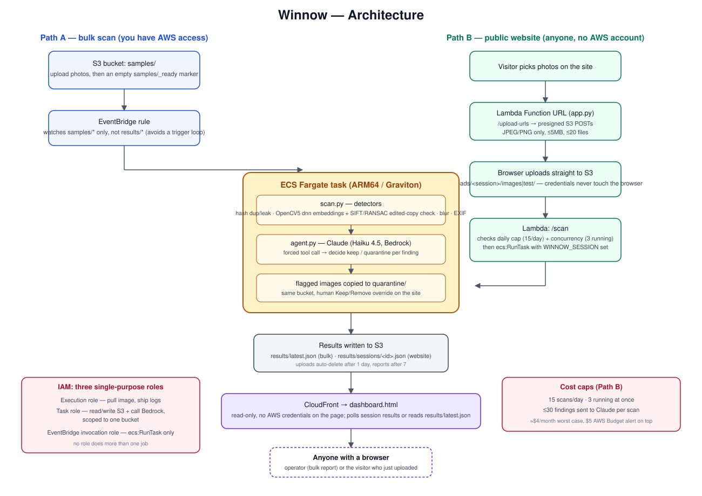

# Winnow — Technical Report

**OpenCV AI Competition 2026 (OpenCV 5 + AWS)**
Ranjeeth Burujula, solo entrant · [github.com/rkb32](https://github.com/rkb32) · Live app: https://d1oc3ay9n04ubj.cloudfront.net/

**What's different here.** Most dataset-quality tools stop at "here's a duplicate." Two things in this project go further, and both are backed by numbers, not a demo:

1. **An AI-reviewer ensemble as a verification layer for the detector's own output.** Every one of the 108 pairs the full audit flagged was independently judged by three Claude agents given different adversarial framings — one neutral, one hunting for differences, one hunting for shared details — with disagreements escalated to a fourth agent reading full-resolution originals (§6). This isn't a chatbot bolted on the side; it's the mechanism that caught a real correctness bug in Winnow's own perceptual-hash check (§6) — something a single-pass detector, or a single unquestioned AI call, would have missed.
2. **A dataset-scale audit that independently reproduces a published research finding**, not a toy demo. Winnow compared all 37.2 million train/val pairs in Imagenette's official split and found the same class of train/test leakage documented in peer-reviewed literature on ImageNet (§6) — with its own numbers, not borrowed ones.
3. **A live agent that looks before it decides, with authority set by measurement.** Where the detector's own numbers can't separate a real copy from a false match, Claude gets the photos and a full-resolution OpenCV zoom tool, picks where to look, and gives a verdict. The first version, allowed to overrule the detector, let 15 of 36 real leaks through. So the agent can now dispute a flag but never clear one. Its disputes are right 82% of the time, and it lets zero leaks through (§6).

---

## 1. Problem

Vision teams spend money on models and labeling and almost nothing verifying the data underneath. Published audits have found duplicate images between the train and test splits of standard benchmarks (Barz & Denzler, 2020, arXiv:1902.00423), and this report's own audit (§6) independently reproduces the same class of flaw in Imagenette, a dataset in active use today.

Train/test leakage is the expensive defect because its symptom looks like good news: the model is graded on material it has already memorized, the reported accuracy is fiction, and the gap only shows up once the model is in production. Near-duplicate training images, blurry frames, and EXIF orientation tags that silently flip an image relative to its label are smaller versions of the same problem — they change what a model actually learns without changing any number a team is watching.

**Winnow scans a folder of images (or two folders, for train/test leakage) and reports the exact files responsible, before training starts.**

## 2. Users

- **Anyone assembling a training set from scraped, crawled, or crowd-collected photos** — the population most exposed to accidental duplication and leakage, and the one with the least tooling. This is who the public website (§4) is built for: no AWS account, no install, upload up to 20 photos and get a report in about a minute.
- **ML practitioners and students validating a dataset before a training run** — the original target of the AWS-connected bulk path, for people who already have a bucket of images and want a scan without touching cloud infrastructure themselves.
- **Anyone reusing a well-known benchmark dataset** — the full-Imagenette audit (§6) shows that "well-known" is not the same as "clean."

## 3. What it catches

| Problem | Method | Why it matters |
|---|---|---|
| Train/test leaks | Both duplicate checks below, run between the training and test sets | A test photo the model has already seen inflates its score without it generalizing any better |
| Exact and compressed copies | Perceptual hash (`cv2.img_hash.BlockMeanHash`), Hamming distance ≤ 5, confirmed by ≥ 8 shared SIFT keypoints or ≥ 0.85 embedding similarity | Duplicates overweight some examples and hide leaks. The confirmation step exists because raw hashes collide on low-texture photos at dataset scale (§6) |
| Edited copies (crops, mirrors, recolors) | Two stages: MobileNetV2 embeddings through OpenCV 5's `cv2.dnn` nominate look-alikes (cosine ≥ 0.80), then SIFT keypoints + RANSAC confirm ≥ 25 points agree on one geometric transform | The perceptual hash catches 0% of cropped or mirrored copies (§6). Embeddings alone flag different photos of the same *kind* of thing; the geometric check is what separates "same photo" from "same subject" |
| Blurry images | Laplacian variance ≤ 200 | Out-of-focus images add noise instead of signal |
| Risky EXIF orientation | Orientation tag ≠ 1 (normal) | Labels drawn on the unrotated photo may no longer line up. Winnow flags the risk; it doesn't read label files, so it can't confirm a mismatch, only surface one |

Claude (Haiku 4.5, via Bedrock) reviews every finding across a scan and decides what to quarantine, through a forced tool call so its output always matches a fixed schema — no free-text parsing to break.

For **borderline edited-copy pairs** (under 35 inliers, or matched keypoints covering under a quarter of a photo), the agent runs a perception, decision, and action loop. It sees both photos, can call an OpenCV zoom tool on any region at full resolution, and returns one verdict per pair: same, different, or unsure. Code then applies the removal rule. A "different" or "unsure" verdict doesn't clear the flag. It marks it **disputed**: the photo stays removed by default, and the dashboard shows the person Claude's reason and zoomed regions so they can overrule it.

## 4. Architecture

Two entry paths feed the same pipeline:

- **Path A — bulk scan.** An operator with AWS access drops photos into an S3 bucket's `samples/` prefix, then uploads an empty `samples/_ready` marker. An EventBridge rule watching only `samples/*` (never `results/*`, to avoid triggering itself) starts an ECS Fargate task.
- **Path B — public website.** A visitor picks photos in the browser. A Lambda Function URL (`winnow/api/app.py`) hands out presigned S3 POST URLs, scoped per file to JPEG/PNG under 5 MB, so the browser uploads straight to S3 without ever holding AWS credentials. The same Lambda then starts a Fargate task scoped to that one upload session, after checking the cost caps described below.

Both paths converge on the same container: `scan.py` runs the detectors, `agent.py` sends the findings to Claude for a quarantine decision, and results land back in S3 (`results/latest.json` for bulk scans, `results/sessions/<id>.json` for website sessions). `dashboard.html`, served read-only through CloudFront with no credentials on the page, reads or polls those results and renders the report — with photo thumbnails, a lightbox, and human Keep/Remove overrides on top of Claude's calls, all client-side.

IAM is split into three single-purpose roles: an execution role (pull the container image, ship logs), a task role (read/write one S3 bucket, call Bedrock), and an EventBridge invocation role (`ecs:RunTask` only). No role does more than one job.

**Cost is capped, not just monitored**, since Path B accepts uploads from anyone with no account: at most 20 files ≤ 5 MB each per scan, at most 3 scans running at once, at most 15 scans per day (an atomic S3 conditional write, `IfNoneMatch="*"`, both de-duplicates repeat requests for the same session and enforces the daily count), and at most 30 findings sent to Claude per scan. Under constant abuse this bounds spend at roughly $4/month; a $5 AWS Budget alert sits on top as a backstop, emailing at 80% of actual spend and 100% of forecasted spend.

## 5. OpenCV 5 implementation

**Perceptual hashing.** `cv2.img_hash.BlockMeanHash` produces a fixed-size fingerprint per image; a pairwise Hamming distance ≤ 5 flags a candidate duplicate. This alone is fast but not sufficient — see the false-positive finding in §6.

**Semantic (edited-copy) detection, two stages:**
1. *Retrieval.* A MobileNetV2 classification model, run through OpenCV 5's `cv2.dnn` module, is used as an embedder rather than a classifier: `winnow/models/make_embedder.py` performs ONNX graph surgery to strip the final classification (`Gemm`) layer, exposing the 1280-dimensional pooled feature vector as the model's own output. Each image's embedding is averaged with its horizontal flip's embedding and L2-normalized, so mirrored copies land at the same point in embedding space as their originals. Cosine similarity ≥ 0.80 nominates a candidate pair.
2. *Verification.* SIFT keypoints are matched between the candidate pair (trying the second image both as-is and mirrored) with a ratio test, then `cv2.findHomography(..., cv2.RANSAC)` counts how many matches agree on one consistent geometric transform. ≥ 25 inliers confirms a real copy; fewer means the embedding matched two different photos of a similar-looking subject, not a copy.

This two-stage design exists because embeddings alone are not selective enough at scale: two different garbage trucks, or two different people holding similar fish, scored up to 0.906 cosine similarity in testing (§6) — well past the retrieval threshold, but not actual duplicates. The geometric check is what makes the distinction, and it's the reason the tool catches crops and mirrors (0% caught by hashing alone) that a hash-only approach misses entirely.

**A genuine OpenCV 5 behavior change surfaced during this build**: `net.forward(<layer_name>)` in OpenCV 4.x accepted a layer name; OpenCV 5's newer graph-execution engine requires the ONNX tensor name instead, and fails with `tensor '...' was not found` otherwise. This was root-caused by inspecting the ONNX graph directly with the `onnx` Python package, and is the reason the embedder is built by editing the graph itself rather than by picking a different `forward()` argument.

**OpenCV as the agent's tools.** The visual review gives Claude OpenCV operations to call rather than pre-rendered images alone. `winnow/zoom.py` produces a thumbnail and a full-resolution crop of any box the model names, in fractions of the photo so coordinates don't depend on what size the model saw. `semantic.match_regions()` keeps the RANSAC inlier coordinates the verifier used to discard, and reports where the geometric match actually sits in each photo. That's both a gate signal (a match confined to a logo-sized patch is suspect) and a hint for where to zoom.

**Everything above is computed from pixels alone** — no label files, no ground truth, no external service beyond Bedrock for the quarantine decision and the borderline-pair review.

## 6. Evaluation

All evaluation is run against real photos from [Imagenette](https://github.com/fastai/imagenette), inside the same Docker image the production pipeline uses. Scripts are in `imagenette_exp/`.

**Does leakage actually inflate accuracy, and does Winnow undo it?** (`imagenette_exp/leak_impact.py`) 75 of 500 test photos were copied into a 1,000-photo training set as exact, resized+recompressed, cropped, and mirrored copies. A 1-nearest-neighbor classifier — which memorizes its training set outright, exaggerating the mechanism but not its direction — scored:

| | Accuracy |
|---|---|
| Clean training set | 24.8% |
| With 75 leaked copies planted | 30.2% (+5.4 points of fake accuracy) |
| After removing what Winnow flagged | 24.4% |

| Leak type | Perceptual hash alone | Hash + two-stage check |
|---|---|---|
| Exact copy | 19/19 | 19/19 |
| Resized + JPEG q30 | 16/19 | 18/19 |
| Cropped 75% | 0/19 | 19/19 |
| Mirrored | 0/18 | 17/18 |
| **Total** | **35/75 (47%)** | **73/75 (97%)** |

Two innocent training photos were also flagged — later confirmed to be genuine, pre-existing Imagenette duplicates, not false alarms.

**A full audit of Imagenette's official split, verified by an AI-reviewer ensemble rather than trusted at face value** (`imagenette_exp/full_audit.py`, `imagenette_exp/full_audit/verified_pairs.csv`). Every one of the 9,469 official training photos was compared against every one of the 3,925 official validation photos — 37.2 million pairs — in 34 minutes on 14 CPU cores, using the same detectors as the live pipeline (multiprocessing for per-image hashing/embedding, a vectorized popcount Hamming distance, and a matrix-multiply for embedding similarity). It flagged 108 pairs.

Rather than accept those 108 flags as ground truth, every one was independently judged by three AI reviewers (Claude agents reading the actual images, not humans) with deliberately different adversarial framings — neutral, a skeptic hunting for differences, a matcher hunting for shared details — and the 6 pairs they disagreed on were escalated to a fourth agent reading the full-resolution originals. This ensemble is what surfaced the correctness bug below: it isn't a demo feature, it's the reason a real bug in Winnow's own detector got caught instead of shipped. Every verdict and its visual evidence is recorded in the CSV, so any individual pair can be re-checked by a person.

- **76 real leaks were found, touching 67 validation photos (1.7% of the validation set)**: 15 are the same photo, 61 are the same scene from a burst of shots taken moments apart. A model scored on those 67 photos has, in effect, already seen them during training. This independently reproduces a documented flaw in ImageNet-family datasets (Northcutt et al., NeurIPS 2021, arXiv:2103.14749 covers label errors specifically; train/val duplication in ImageNet is separately documented in "Flaws of ImageNet, Computer Vision's Favourite Dataset," ICLR 2025 blog track, arXiv:2412.00076) — Winnow did not discover a new flaw here, it caught a known one automatically, in a dataset still used for benchmarking today.
- **The two-stage check was 80% precise at this scale (76 of 95 embedding+keypoint flags were real)**. The false alarms were mostly stock-photo templates — the same watermark or brochure layout around a different product — plus one church photographed on a different day.
- **All 13 raw perceptual-hash matches were false**, and finding that out is what led to a real bug fix in the tool itself (below).

**A correctness bug found by running at real scale.** All 13 raw `BlockMeanHash` matches in the full audit — verified independently by the AI review — turned out to be different photos: low-texture images (products on white backgrounds, silhouettes against open sky) that collide under this hash purely because they lack texture, sharing at most 6 keypoints and at most 0.80 embedding similarity. Every one of 165 *genuine* compressed copies the hash correctly caught in the same audit shared 9 or more keypoints. This is invisible at the 20-photo scale most people would test at, and guaranteed at dataset scale — 37 million pairs is enough to find every collision a hash function has. The fix (`confirm_hash_pairs()` in `winnow/semantic.py`) now requires a raw hash match to also clear ≥ 8 shared SIFT keypoints or ≥ 0.85 embedding similarity before being trusted. Re-running `leak_impact.py` after the fix produced an identical 73/75 result, confirming zero recall was lost, and a regression test (`test_hash_collision_between_different_photos_is_not_reported`) reproduces the collision with a synthetic image pair engineered to collide at Hamming distance 0.

**Why two stages, not just embeddings?** (`imagenette_exp/semantic_eval.py`, `calibrate_verify.py`) Embeddings alone looked perfect on a small 4,950-pair sample, but at 500,000 pairs, different photos of the same kind of subject — two men holding similar fish, two garbage trucks — scored up to 0.906 cosine similarity, well above the 0.80 candidate threshold. Adding the SIFT+RANSAC geometric check cut 1,772 look-alike candidates down to the 2 that were real duplicates, while genuine copies matched with medians of 84–311 shared keypoints — an order of magnitude separation from the false candidates.

**Letting the agent look: three versions, measured.** (`imagenette_exp/review_band.py`, `review_eval.py`) Among the audit's 95 keypoint-verified flags, 12 of 19 false matches and 26 of 76 real leaks sat at 25–34 inliers, a band where the detector's own score can't tell them apart. Adding "matched keypoints cover under a quarter of a photo" catches 3 more false matches (15 of 19). The false matches that beat both signals are stock composites, like the same ad background pasted behind different trucks, which look like perfect copies to any geometric check. Every audit pair the gate selects (51: 36 real leaks, 15 false matches) was run through the live agent against real Bedrock, one pair per call, and scored against the verified verdicts:

| Version | False matches caught | Real leaks wrongly doubted | Real leaks let through |
|---|---|---|---|
| 1. Claude decides keep/remove per photo | 7/15 | — | **15/36** |
| 2. Claude may only dispute, per photo | 9/15 | 18/36 | 0 |
| 3. Claude gives one verdict per pair; code applies the rule | **9/15** | **2/36** | **0** |

Version 1 did more harm than good. Its own reasons showed why: "same kite scene, different photo angles; both worth keeping" treats a burst of the same moment as two photos, but a model trained on one has seen the other. The prompt was given that definition, and the agent lost the authority to clear a flag. Version 2's disputes were right only 9 of 27 times, and its reasons showed a second problem: "real match, but quarantine the test image instead", i.e. confusion about *which* photo the rule removes, not about the photos. Version 3 asks the model only the visual question and leaves the rule to code. 9 of its 11 disputes were right (82%), no leak gets through by default, and each reviewed pair costs $0.005. In a live end-to-end run through the public site on the new image, the chainsaw pair came back disputed with "different chainsaw models: red Echo vs red/beige… different engines, design" after two zooms, in 30 seconds.

**Test suite.** 62 pytest tests run inside the exact production Docker image (`docker build --target test winnow/`): every detector, the full `scan_folder` pipeline, Claude's decision handling against a stubbed Bedrock (id-to-filename mapping, truncated replies, the findings cap), the visual review loop (per-pair zoom budgets, the forced final decision, bad zoom requests returned to the model, the can't-clear-a-flag rule), and the upload API's guardrails (hostile filenames, session-id validation, daily and concurrency caps). To confirm the suite has real detection power rather than passing trivially, three deliberate bugs were introduced one at a time — a broken hash threshold, a disabled keypoint check, an off-by-one in the daily cap — and the suite caught each one.

## 7. Limitations and future work

- **Duplicate comparison is O(n²)** in the live pipeline: every image is hashed against every other image. Fine for hundreds of photos (the public website's use case); the 37-million-pair full audit needed multiprocessing and a vectorized distance computation to finish in 34 minutes, and a real production dataset at that scale would need an approximate-nearest-neighbor index (FAISS, Annoy) instead of brute-force pairwise comparison.
- **Some thresholds are calibrated, others are fixed.** The edited-copy thresholds (0.80 similarity, 25 keypoints) were calibrated against Imagenette — one dataset. The blur threshold (Laplacian variance ≤ 200) is a fixed number that depends on image resolution, so it can misfire on plain-background shots or miss soft focus in very large photos. A per-dataset relative threshold would generalize better than either fixed number.
- **Flags are for human review, not automatic deletion, at dataset scale.** 20% of the keypoint-stage flags in the full audit were look-alikes sharing a stock template or landmark rather than true duplicates. The website's thumbnail previews and Keep/Remove overrides exist specifically so a human makes the final call, not the tool.
- ~~The keypoint check recomputes SIFT features per pair~~ — **fixed**: features are now cached per photo instead of per comparison, so a photo checked against many others only pays that cost once. This was the dominant cost in the full audit above, where the keypoint stage accounted for most of the 34-minute runtime.
- **The visual review is only measured at 160px.** All 51 evaluation pairs come from Imagenette's small version, while uploads to the site are usually full resolution, where zooming has more to find. The remaining misses are hard cases even for people: the same chainsaw model in two different catalog photos, the same church on another day. The review is bounded for cost: it only runs on scans with ≤ 8 findings, at most 2 pairs and 2 zooms per pair, in one zoom round (across 51 reviews the model never asked for a second).
- **A copy that is both cropped and heavily recompressed can slip through both checks** — 2 of 75 planted leaks in the impact study were missed this way.
- **EXIF orientation flags are a risk signal, not a confirmed defect**: Winnow doesn't read label/annotation files, so it can flag a rotation conflict without being able to say whether it actually shifted a bounding box.
- **The public website's photo previews exist only in the browser tab that ran the scan** — thumbnails are drawn from the visitor's own local files, not from a stored copy, so reloading a shared results link shows the report without images.
- **The Bedrock agent needs a one-time account-level setup**: AWS requires each account to submit a model-access use case to Anthropic before Claude can be invoked via Bedrock. This is a manual step outside the pipeline's control.
- **Public uploads are capped, not authenticated.** Anyone can run a scan without an account, so cost is bounded by hard limits (§4) rather than per-user quotas. The tradeoff: someone who exhausts the daily cap blocks real visitors until it resets the next day. A production version would put uploads behind accounts with per-user limits instead of a shared global one.
- **Scope is intentionally narrower than the original competition proposal.** The proposal described a larger system (banded hash indexing, SQS fan-out, DynamoDB job state, an industrial-inspection demo vertical). Building solo, the scope was cut to what could be evaluated with real evidence rather than left half-finished: two entry paths into one Fargate pipeline, calibrated and audited against a real public dataset, with a public site anyone can actually use today. The cut features (approximate-nearest-neighbor indexing, a distributed job queue) are exactly the ones listed above as future work, not abandoned — they were the right things to defer once evidence, not more features, became the priority.

## 8. Responsible-use considerations

- **Privacy.** Winnow reads images in place and never stores or forwards pixels beyond the lifetime of a scan. On the public website, uploaded photos live under a per-session S3 prefix that is never publicly readable (CloudFront can only serve `dashboard.html` and the `results/` JSON, not `uploads/`), and lifecycle rules delete uploads after 1 day and reports after 7. There is no account system and no tracking beyond a random session id used solely to route a scan back to the browser that requested it.
- **Automated decisions stay reversible.** Claude's quarantine calls are recommendations rendered on a dashboard with per-item Keep/Remove overrides — nothing is deleted automatically, and the "cleaned" download is built client-side from whatever the human operator actually approved.
- **The agent's authority was set by measurement, not assumed.** When the review agent could clear flags, it let 15 of 36 real leaks through. Since a missed leak costs more than a wrongly removed photo, it can now only dispute a flag, and a person makes the final call. Zoom evidence is stored as coordinates, never pixels, because results are publicly readable. The dashboard redraws each zoomed region from the visitor's own copy of the photo.
- **Honest reporting of uncertainty.** The dashboard states explicitly when Claude's response was truncated or errored rather than silently showing a partial result, and EXIF findings are worded as a risk ("check labels"), not a confirmed defect, since Winnow cannot see annotation files.
- **The Imagenette finding in §6 is reported as an independent reproduction of a previously published dataset flaw, not a new discovery** — verified against the literature before being included here, rather than presented as novel.
- **Abuse resistance on a public, unauthenticated endpoint.** File type, size, and count are validated server-side before any presigned URL is issued; filenames are sanitized; and the daily/concurrency/per-scan caps in §4 exist specifically so an anonymous public tool cannot be turned into an open-ended compute or cost sink.

## 9. Repository

- `winnow/` — the pipeline: detectors, S3 glue, Bedrock agent, Dockerfile, ECS task definition, dashboard
- `winnow/api/` — the public upload API (Lambda) and its deploy script
- `winnow/tests/` — the 62-test suite, run inside the production image
- `spike/` — the original dependency spike proving OpenCV 5 + `img_hash` on ARM64
- `imagenette_exp/` — every evaluation script and result referenced in §6
- `proposal.md` — the original competition proposal
